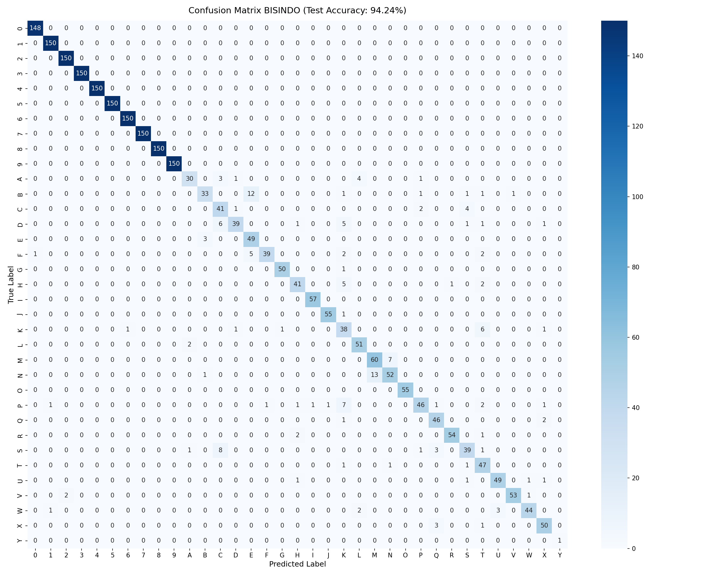

# 🤟 BISINDO Sign Language Detection

Sistem deteksi gesture tangan **BISINDO** (Bahasa Isyarat Indonesia) secara real-time berbasis koordinat landmark tangan, dengan web demo interaktif menggunakan Streamlit.

> **Portofolio project** — bukan bagian dari skripsi.

---

## 🎯 Overview

| | |
|---|---|
| **Task** | Klasifikasi gesture statis: alfabet **A–Y** dan angka **0–9** (35 kelas) |
| **Input** | Koordinat landmark tangan dari MediaPipe HandLandmarker (63 fitur) |
| **Model** | MLP (Multi-Layer Perceptron) berbasis Keras/TensorFlow |
| **Demo** | Web app real-time dengan Streamlit + streamlit-webrtc |
| **Test Accuracy** | **94.24%** pada test set |

---

## 🏗️ Arsitektur Sistem

```
Dataset Gambar BISINDO
        │
        ▼
MediaPipe HandLandmarker ──► 21 landmark (x, y, z) = 63 fitur
        │
        ▼
Normalisasi (relatif ke wrist + scale)
        │
        ▼
MLP: Dense(128) → Dropout(0.3) → Dense(64) → Dropout(0.3) → Dense(35, softmax)
        │
        ▼
Web Demo (Streamlit, server-side inference)
```

Semua preprocessing (MediaPipe) dan inference berjalan di **server Python**, bukan di browser.

---

## 📊 Hasil Model

- **Test Accuracy: 94.24%** | Test Loss: 0.1957
- Angka 0–9 mencapai F1-score hampir sempurna (>0.99) karena dataset lebih besar dan gesture lebih distingtif
- Huruf yang paling sering tertukar: **K, B, S** (gesture visual mirip)



---

## 📁 Struktur Project

```
sign-language-bisindo/
├── Data/                        # Dataset mentah (gitignored)
├── notebooks/
│   ├── extract_landmarks.ipynb  # Eksplorasi ekstraksi landmark
│   └── train_model.ipynb        # Eksplorasi training & evaluasi
├── training/
│   ├── extract_landmarks.py     # Script ekstraksi landmark (paralel)
│   ├── train_model.py           # Script training MLP
│   ├── evaluate.py              # Script evaluasi lengkap
│   ├── classes.json             # Daftar 35 kelas
│   ├── classification_report.txt
│   └── confusion_matrix.png
├── web/
│   ├── app.py                   # Entry point Streamlit
│   ├── requirements.txt
│   └── model/
│       ├── model_bisindo.keras  # Model hasil training
│       └── classes.json
├── AGENTS.md
├── ARCHITECTURE.md
├── PRD.md
├── IMPLEMENTATION.md
└── README.md
```

---

## 🚀 Menjalankan Web Demo

### 1. Install dependencies

```bash
cd web
pip install -r requirements.txt
```

### 2. Download MediaPipe model asset

File `hand_landmarker.task` dibutuhkan oleh pipeline training. Download manual:

```bash
curl -o hand_landmarker.task https://storage.googleapis.com/mediapipe-models/hand_landmarker/hand_landmarker/float16/1/hand_landmarker.task
```

> Untuk web demo, file ini tidak diperlukan — MediaPipe dijalankan langsung via `mediapipe.tasks` di `app.py`.

### 3. Jalankan Streamlit

```bash
streamlit run web/app.py
```

Buka `http://localhost:8501`, klik **START**, arahkan tangan ke kamera.

---

## 🔁 Menjalankan Ulang Training Pipeline

Jika ingin melatih ulang dari awal dengan dataset sendiri:

```bash
# 1. Ekstraksi landmark
python training/extract_landmarks.py --data_dir Data --output data/landmarks_bisindo.csv

# 2. Training
python training/train_model.py --data data/landmarks_bisindo.csv

# 3. Evaluasi
python training/evaluate.py
```

Susun dataset per folder kelas:

```
Data/
├── A/   (gambar gesture huruf A)
├── B/
├── ...
├── 0/
└── 9/
```

---

## 🛠️ Tech Stack

| Komponen | Library |
|---|---|
| Ekstraksi landmark | mediapipe (HandLandmarker) |
| Training model | tensorflow / keras |
| Web demo | streamlit, streamlit-webrtc |
| Preprocessing video | opencv-python-headless |
| Data processing | numpy, pandas, scikit-learn |

---

## 📌 Catatan

- Normalisasi landmark di inference (`web/app.py`) **identik** dengan saat training: translasi relatif ke wrist → dibagi nilai absolut maksimum.
- Tidak ada data webcam pengguna yang disimpan secara permanen — frame diproses per-request untuk inference saja.
- Gesture **Z** tidak termasuk karena merupakan dynamic gesture (memerlukan gerakan).
